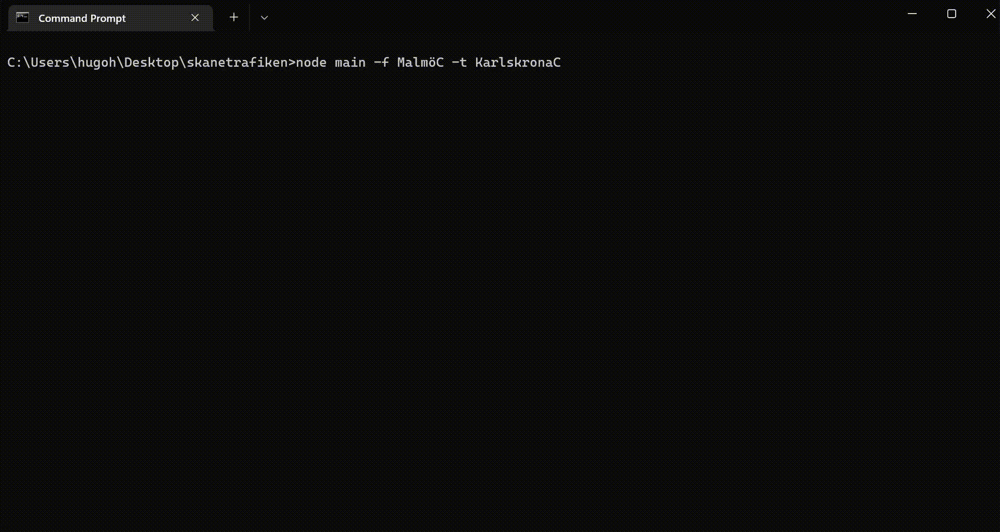

# Skånetrafiken CLI

<p align="center">
  
</p>

### Running the application

Look at the table to get required flags, some are just optional.<br>
**node main -f <"from"> -t <"to">** is the basic command.

| Flag | Comment                                                                           | Required |
|------|-----------------------------------------------------------------------------------|----------|
| -f   | **From**. ``-f Stockholm`` for example                                            | ✅        |
| -t   | **To**. ``-t Göteborg`` for example                                               | ✅        |
| -p   | **Preset**. - ``preset.json`` contains ``f`` & ``t`` if same travel is used often | ❌        |

## Documentation

CLI based tool built in Node.JS to faster look up departures on Skånetrafiken.se<br>
Since Skånetrafiken closed their open API on ``March 31st 2021`` I had to write my own unofficial one.<br>
Looking at what type of requests they make on the website it's simple to reverse engineer the structure.

### First Endpoint

The first endpoint is used to find the **ID**/**id2** of the location we want to departure from.<br>
``https://www.skanetrafiken.se/gw-tps/api/v2/Points?name=<leavingFrom>``
<br>For example inputting ``Malmö C`` would net something like this below...

```json
{
  "api": "se.skanetrafiken.api",
  "points": [
    {
      "id2": "12080000",
      "name": "Malmö C",
      "type": "STOP_AREA",
      "lat": 55.608776969287014,
      "lon": 13.000200411816095,
      "countyCode": 12,
      "countryCode": 46
    },
    {
      "id2": "12080120",
      "name": "Malmö Södervärn",
      "type": "STOP_AREA",
      "lat": 55.588614619181435,
      "lon": 13.006955357872286,
      "countyCode": 12,
      "countryCode": 46
    },
    {
      "id2": "12080140",
      "name": "Malmö Triangeln",
      "type": "STOP_AREA",
      "lat": 55.594285624273034,
      "lon": 13.000711742777334,
      "countyCode": 12,
      "countryCode": 46
    }
  ]
}
```

Then extracting the id2 gives us the "key" for the next step. All of this goes for the destination aswell.

### Second Endpoint

Second endpoint is used to actually gather all the data needed. This being...
```https://www.skanetrafiken.se/gw-tps/api/v2/Journey?fromPointId=<from>&fromPointType=STOP_AREA&toPointId=<to>&toPointType=STOP_AREA&arrival=false&journeysAfter=6```
<br>Then inserting the gathered ``id2`` both from which place you are leaving and the destination desired gives all the
data.
<br>An example response is...

```json
{
  "api": "se.skanetrafiken.api",
  "time": "2022-05-02T13:00:37Z",
  "usedSearchTime": "2022-05-02T13:00:00Z",
  "refreshRateSeconds": 30,
  "id": "1404376345495160252",
  "journeyResultKey": "1404376345495160252",
  "journeys": [
    {
      "id": 1,
      "sequenceNo": 1,
      "noOfChanges": 0,
      "priceZoneList": "12000350,12000320",
      "routeLinks": [
        {
          "id": "17531032410063107687000794400170018",
          "from": {
            "name": "Hässleholm C",
            "time": "2022-05-02T13:11:00Z",
            "pos": "Spår 3",
            "stopPointCoordinate": {
              "lat": 56.15853475472508,
              "lon": 13.763837893148956
            },
            "deviation": 3,
            "passed": false,
            "coordinate": {
              "lat": 56.158040247405935,
              "lon": 13.76326855025099
            },
            "id2": "12093070",
            "timePoint": true
          },
          "to": {
            "name": "Kristianstad C",
            "time": "2022-05-02T13:31:00Z",
            "pos": "Spår 1a",
            "stopPointCoordinate": {
              "lat": 56.03161576640895,
              "lon": 14.151439298669743
            },
            "deviation": 0,
            "passed": false,
            "coordinate": {
              "lat": 56.03186627612205,
              "lon": 14.151364406047241
            },
            "id2": "12090042",
            "timePoint": true
          },
          "line": {
            "name": "Öresundståg",
            "type": "TrainOresund",
            "no": "1058",
            "lineNo": 12000802,
            "lineNoString": "12000802",
            "color": "FFCAC6C5",
            "outlineColor": "FF787775",
            "towards": "mot Karlskrona",
            "runNo": 1058,
            "subType": "Öresundståg",
            "occupancySupport": true,
            "operatorId": "28",
            "operatorName": "SJ Öresund AB"
          }
        }
      ]
    },
    {
      "id": 2,
      "sequenceNo": 2,
      "noOfChanges": 0,
      "priceZoneList": "12000350,12000351,12000328,12000320",
      "routeLinks": [
        {
          "id": "17531032410063108661301029300250028",
          "from": {
            "name": "Hässleholm C",
            "time": "2022-05-02T13:32:00Z",
            "pos": "Spår 5",
            "stopPointCoordinate": {
              "lat": 56.15689525584063,
              "lon": 13.762476220547603
            },
            "deviation": 0,
            "passed": false,
            "coordinate": {
              "lat": 56.158040247405935,
              "lon": 13.76326855025099
            },
            "id2": "12093070",
            "timePoint": true
          },
          "to": {
            "name": "Kristianstad C",
            "time": "2022-05-02T13:54:00Z",
            "pos": "Spår 3a",
            "stopPointCoordinate": {
              "lat": 56.0315234099703,
              "lon": 14.151250735136648
            },
            "deviation": 0,
            "passed": false,
            "coordinate": {
              "lat": 56.03186627612205,
              "lon": 14.151364406047241
            },
            "id2": "12090042",
            "timePoint": true
          },
          "line": {
            "name": "Pågatåg",
            "type": "Train",
            "no": "1222",
            "lineNo": 12000812,
            "lineNoString": "12000812",
            "color": "FF8782C1",
            "outlineColor": "FF6059A2",
            "towards": "mot Kristianstad C",
            "runNo": 1222,
            "subType": "Pågatåg",
            "occupancySupport": true,
            "operatorId": "30",
            "operatorName": "Arriva Tåg AB"
          }
        }
      ]
    }
  ]
}
```
